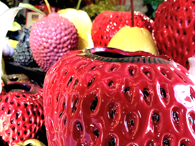
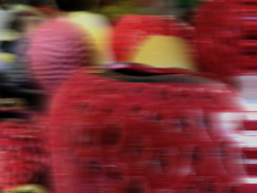
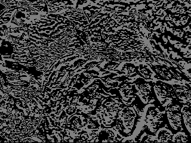

# `blurry`

[](https://github.com/octu0/blurry/blob/master/LICENSE)
[](https://godoc.org/github.com/octu0/blurry)
[](https://goreportcard.com/report/github.com/octu0/blurry)
[](https://github.com/octu0/blurry/releases)

**fast**, high peformance image processing libary.

`blurry` provides image filtering with [halide-lang](https://halide-lang.org/) backend.  
implements optimized processing for amd64 CPUs on Linux/macos

## Installation

```shell
$ go get github.com/octu0/blurry
```

## Filter Examples

original image


### Rotate

rotation 0/90/180/270 clockwise

```go
img, err := blurry.Rotate(input, blurry.Rotate90)
```

| `blurry.RotationMode` | Result   |
| :-------------------: | :------: |
| `blurry.Rotate90`     |  |
| `blurry.Rotate180`    |  |
| `blurry.Rotate270`    |  |

### Grayscale

```go
img, err := blurry.Grayscale(input)
```


### Invert

```go
img, err := blurry.Invert(input)
```


### Brightness

```go
img, err := blurry.Brightness(input, 1.5)
```



### Gamma

```go
img, err := blurry.Gamma(input, 2.5)
```


### Contrast

```go
img, err := blurry.Contrast(input, 0.525)
```


### BoxBlur

```go
img, err := blurry.Boxblur(input, 11)
```


### GaussianBlur

```go
img, err := blurry.Gaussianblur(input, 5.0)
```



### Emboss

```go
img, err := blurry.Emboss(input)
```


### HighPass

```go
img, err := blurry.Highpass(input)
```


### Laplacian

```go
img, err := blurry.Laplacian(input)
```


### Gaussian

```go
img, err := blurry.Gaussian(input)
```


### Gradient

```go
img, err := blurry.Gradient(input)
```



### Edge

a.k.a. EdgeDetection

```go
img, err := blurry.Edge(input)
```


### Sobel

```go
img, err := blurry.Sobel(input)
```


### BlockMozaic

```go
img, err := blurry.Blockmozaic(input, 10)
```


## CLI usage

Run it via docker.  
Use `docker run -v` to specify where to load the images and where to output them (`/tmp` will be used as a temporary file).

```shell
$ mkdir myimagedir
$ mkdir myimageout
$ cp /from/img/path.png myimagedir/src.png

# grayscale
$ docker run --rm -it \
  -v $PWD/myimagedir:/img \
  -v $PWD/myimageout:/tmp \
  blurry:1.0.0 grayscale -i /img/src.png
```

#### Help

```
NAME:
   blurry

USAGE:
   blurry [global options] command [command options] [arguments...]

VERSION:
   1.7.0

COMMANDS:
     blockmozaic   
     boxblur       
     brightness    
     clone         
     contrast      
     edge          
     emboss        
     gamma         
     gaussianblur  
     gradient      
     grayscale     
     highpass      
     invert        
     laplacian     
     rotate        
     sobel         
     help, h       Shows a list of commands or help for one command

GLOBAL OPTIONS:
   --debug, -d    debug mode
   --verbose, -V  verbose. more message
   --help, -h     show help
   --version, -v  print the version
```

# Benchmarks

## Halide JIT benchmarks

This is the result of using halide's [benchamrk](https://github.com/halide/Halide/blob/master/tools/halide_benchmark.h).  
darwin/amd64 Intel(R) Core(TM) i7-8569U CPU @ 2.80GHz

```
benchmark...
src 320x240
BenchmarkJIT/cloneimg            : 0.01778ms
BenchmarkJIT/rotate              : 0.02033ms
BenchmarkJIT/grayscale           : 0.11328ms
BenchmarkJIT/invert              : 0.08340ms
BenchmarkJIT/brightness          : 0.08455ms
BenchmarkJIT/gammacorrection     : 0.12865ms
BenchmarkJIT/contrast            : 0.09949ms
BenchmarkJIT/boxblur             : 0.32689ms
BenchmarkJIT/gaussianblur        : 0.31575ms
BenchmarkJIT/edge                : 0.10537ms
BenchmarkJIT/sobel               : 0.12847ms
BenchmarkJIT/emboss              : 0.25908ms
BenchmarkJIT/laplacian           : 0.23458ms
BenchmarkJIT/highpass            : 0.32065ms
BenchmarkJIT/gradient            : 0.25294ms
BenchmarkJIT/gaussian            : 0.31567ms
BenchmarkJIT/blockmozaic         : 0.33579ms
```

## AOT benchmarks

Calling a library compiled by AOT(ahead-of-time) via cgo.  
In [cgo](https://golang.org/cmd/cgo/), due to the overhead of ffi calls([e.g.](https://about.sourcegraph.com/go/gophercon-2018-adventures-in-cgo-performance/)), 
more complex operations will be optimized for CPU and become faster.  
Also, the execution speed may be reduced by the overhead of multiple calls.

### Blur

/D is `DisablePool`, i.e. the benchmark when BufferPool is off.

```
goos: darwin
goarch: amd64
pkg: github.com/octu0/blurry
cpu: Intel(R) Core(TM) i7-8569U CPU @ 2.80GHz
BenchmarkBlur
BenchmarkBlur/bild/blur/Box
BenchmarkBlur/bild/blur/Box-8         	     146	   8315664 ns/op	  640290 B/op	      11 allocs/op
BenchmarkBlur/bild/blur/Gaussian
BenchmarkBlur/bild/blur/Gaussian-8    	     325	   3635977 ns/op	 1262544 B/op	      21 allocs/op
BenchmarkBlur/imaging/Blur
BenchmarkBlur/imaging/Blur-8          	     760	   1545757 ns/op	  793698 B/op	      45 allocs/op
BenchmarkBlur/stackblur-go
BenchmarkBlur/stackblur-go-8          	     240	   4956251 ns/op	  925933 B/op	  153609 allocs/op
BenchmarkBlur/blurry/Boxblur
BenchmarkBlur/blurry/Boxblur-8        	    2107	    570486 ns/op	      88 B/op	       2 allocs/op
BenchmarkBlur/blurry/Gaussianblur
BenchmarkBlur/blurry/Gaussianblur-8   	    1650	    726642 ns/op	     277 B/op	       2 allocs/op
BenchmarkBlur/blurry/Boxblur/D
BenchmarkBlur/blurry/Boxblur/D-8      	    1921	    613347 ns/op	  311360 B/op	       2 allocs/op
BenchmarkBlur/blurry/Gaussianblur/D
BenchmarkBlur/blurry/Gaussianblur/D-8 	    1524	    821776 ns/op	  311361 B/op	       2 allocs/op
```

### Contrast

/D is `DisablePool`, i.e. the benchmark when BufferPool is off.

```
goos: darwin
goarch: amd64
pkg: github.com/octu0/blurry
cpu: Intel(R) Core(TM) i7-8569U CPU @ 2.80GHz
BenchmarkContrast
BenchmarkContrast/bild/Contrast
BenchmarkContrast/bild/Contrast-8         	    6492	    181388 ns/op	  311707 B/op	       6 allocs/op
BenchmarkContrast/imaging/Contrast
BenchmarkContrast/imaging/Contrast-8      	    8670	    143229 ns/op	  313794 B/op	       7 allocs/op
BenchmarkContrast/blurry/Contrast
BenchmarkContrast/blurry/Contrast-8       	   10000	    111556 ns/op	     119 B/op	       2 allocs/op
BenchmarkContrast/blurry/Contrast/D
BenchmarkContrast/blurry/Contrast/D-8     	    8809	    134217 ns/op	  311360 B/op	       2 allocs/op
```

### Edge

```
goos: darwin
goarch: amd64
pkg: github.com/octu0/blurry
cpu: Intel(R) Core(TM) i7-8569U CPU @ 2.80GHz
BenchmarkEdge
BenchmarkEdge/bild/EdgeDetection
BenchmarkEdge/bild/EdgeDetection-8         	     642	   1885417 ns/op	  631324 B/op	      10 allocs/op
BenchmarkEdge/blurry/Edge
BenchmarkEdge/blurry/Edge-8                	    8272	    132898 ns/op	  311478 B/op	       3 allocs/op
```

### Sobel

```
goos: darwin
goarch: amd64
pkg: github.com/octu0/blurry
cpu: Intel(R) Core(TM) i7-8569U CPU @ 2.80GHz
BenchmarkSobel
BenchmarkSobel/bild/Sobel
BenchmarkSobel/bild/Sobel-8         	     207	   6021277 ns/op	 2196771 B/op	      32 allocs/op
BenchmarkSobel/blurry/Sobel
BenchmarkSobel/blurry/Sobel-8       	     994	   1210391 ns/op	  311454 B/op	       2 allocs/op
```

### Gamma

```
goos: darwin
goarch: amd64
pkg: github.com/octu0/blurry
cpu: Intel(R) Core(TM) i7-8569U CPU @ 2.80GHz
BenchmarkGamma
BenchmarkGamma/bild/Gamma
BenchmarkGamma/bild/Gamma-8         	    6016	    196563 ns/op	  311707 B/op	       6 allocs/op
BenchmarkGamma/imaging/Gamma
BenchmarkGamma/imaging/Gamma-8      	    7688	    158088 ns/op	  313793 B/op	       7 allocs/op
BenchmarkGamma/blurry/Gamma
BenchmarkGamma/blurry/Gamma-8       	    6918	    174179 ns/op	  311454 B/op	       2 allocs/op
```

### Grayscale

/D is `DisablePool`, i.e. the benchmark when BufferPool is off.

```
goos: darwin
goarch: amd64
pkg: github.com/octu0/blurry
cpu: Intel(R) Core(TM) i7-8569U CPU @ 2.80GHz
BenchmarkGrayscale
BenchmarkGrayscale/bild/Grayscale
BenchmarkGrayscale/bild/Grayscale-8         	    7040	    168305 ns/op	  622813 B/op	       6 allocs/op
BenchmarkGrayscale/imaging/Grayscale
BenchmarkGrayscale/imaging/Grayscale-8      	    8408	    145552 ns/op	  313514 B/op	       6 allocs/op
BenchmarkGrayscale/blurry/Grayscale
BenchmarkGrayscale/blurry/Grayscale-8       	    6405	    190756 ns/op	     136 B/op	       2 allocs/op
BenchmarkGrayscale/blurry/Grayscale/D
BenchmarkGrayscale/blurry/Grayscale/D-8     	    5882	    201173 ns/op	  311360 B/op	       2 allocs/op
```

# Build

When building, create a docker container with Halide(clang, llvm, etc).
installed as the build environment.

```shell
$ make build-generator
```

Compile `libruntime.a` and all kinds `lib*_osx.a` or `lib*_linu.a` to make static link.

```shell
$ make generate
```

Finally, generate a docker image if necessary.

```
$ make build
```

# Develop

Set up configuration for macos to be able to run image filtering directly through Halide.

## setup Halide on local

```shell
$ make setup-halide-runtime
```

## generate and run

`genrun` package allows you to export images to temporary file and run image filtering directly.

```shell
$ go run cmd/genrun/main.go benchmark
```

# License

MIT, see LICENSE file for details.
